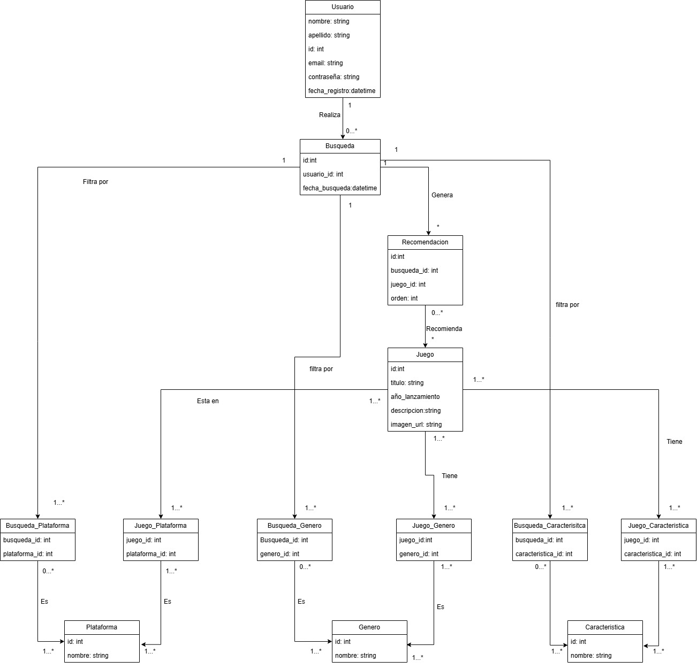

# Propuesta TP DSW - 2026

## Grupo

### Integrantes

* 53725 - Sardi Nieva, Santiago
* 52158 - Ripacolli Fuentes, Santino Jorge
* 54191 - Petazzi Cardetti, Juan Cruz
* 54196 - Garcia, Mateo

### Repositorios

* [frontend app](https://github.com/petazzijuann/mygamesearcher-frontend)
* [backend app](https://github.com/petazzijuann/mygamesearcher-backend)

## Tema

### Descripción

My Game Searcher es una aplicación orientada a usuarios que utilizan los videojuegos como medio de entretenimiento pero no saben qué jugar. El sistema permite ingresar información básica, como los géneros y características de juegos preferidos (Historia, RPG, Competitivo, etc.) y la plataforma utilizada (por ejemplo, PC, PlayStation, Xbox o Switch), y a partir de estos datos genera entre 1 y 3 recomendaciones de videojuegos adaptadas a las preferencias del usuario. El objetivo principal del sistema es facilitar la toma de decisión del usuario, ofreciendo sugerencias personalizadas en base a sus gustos y limitaciones tecnológicas.

### Modelo

## Alcance Funcional

### Alcance Mínimo

**Regularidad:**

| Req | Detalle |
|:-|:-|
| CRUD simple | 1. CRUD Género 2. CRUD Plataforma 3. CRUD Característica 4. CRUD Clasificación de Edad |
| CRUD dependiente | 1. CRUD Juego {depende de} CRUD Género, CRUD Plataforma, CRUD Clasificación de Edad 2. CRUD Usuario {depende de} CRUD Plataforma |
| Listado + detalle | 1. Listado de juegos filtrado por género y plataforma, muestra nombre, género y plataforma => detalle muestra datos completos del juego incluyendo clasificación de edad y características 2. Listado de recomendaciones del usuario filtrado por fecha, muestra nombre del juego, géneros y plataforma recomendada => detalle muestra la búsqueda realizada y los juegos sugeridos |
| CUU/Epic | 1. Registrar usuario y configurar preferencias 2. Generar recomendaciones personalizadas de juegos |

**Adicionales para Aprobación:**

| Req | Detalle |
|:-|:-|
| CRUD | 1. CRUD Género 2. CRUD Plataforma 3. CRUD Característica 4. CRUD Clasificación de Edad 5. CRUD Juego 6. CRUD Usuario |
| CUU/Epic | 1. Registrar usuario y configurar preferencias 2. Generar recomendaciones personalizadas de juegos 3. Administrar catálogo de juegos (carga y edición por admin) 4. Calificar una recomendación recibida |

> Los CUUs 2 y 4 están relacionados entre sí: la recomendación generada en el CUU 2 es el input que el usuario califica en el CUU 4.

### Alcance Adicional Voluntario

| Req | Detalle |
|:-|:-|
| Listados | 1. Juegos más recomendados filtrado por género, muestra nombre, plataforma y cantidad de veces recomendado 2. Historial de búsquedas del usuario, muestra fecha, preferencias ingresadas y juegos sugeridos |
| CUU/Epic | 1. Marcar juego como "ya jugado" o "me interesa" |
| Otros | 1. Envío de recomendación por email al usuario |

## Requerimientos Funcionales

| id | Req |
|:-|:-|
| 1 | Registrar datos personales del usuario para crear la cuenta |
| 2 | Iniciar y cerrar sesión |
| 3 | Modificar o eliminar cuenta del usuario |
| 4 | Registrar y modificar las preferencias del usuario |
| 5 | Mostrar recomendaciones de juegos destacadas filtradas por popularidad o calificación |
| 6 | Mostrar los juegos que cumplen con las especificaciones ingresadas |
| 7 | Mostrar todos los detalles del juego seleccionado por el usuario |
| 8 | Registrar el juego como preferencia para recomendar juegos similares |
| 9 | Mostrar juegos relacionados a uno seleccionado |
| 10 | Administrar el catálogo de juegos (altas, bajas y modificaciones) |
| 11 | Calificar una recomendación recibida y visualizar el historial de calificaciones |

## Requerimientos No Funcionales

| id | Req |
|:-|:-|
| 1 | Las contraseñas deben almacenarse hasheadas |
| 2 | La interfaz debe adaptarse a mobile y escritorio |
| 3 | Las recomendaciones deben generarse con baja latencia |
| 4 | El catálogo debe soportar el crecimiento en la cantidad de juegos sin degradar el rendimiento |
