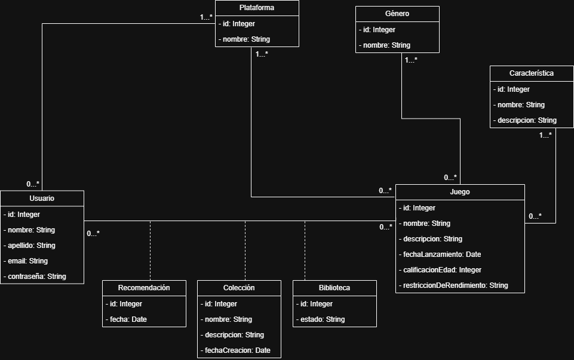

# Propuesta TP DSW - 2026

## Grupo

### Integrantes

* 53725 - Sardi Nieva, Santiago
* 52158 - Ripacolli Fuentes, Santino Jorge
* 54191 - Petazzi Cardetti, Juan Cruz
* 54196 - Garcia, Mateo

### Repositorios

* [frontend app](https://github.com/petazzijuann/mygamesearcher-frontend)
* [backend app](https://github.com/petazzijuann/mygamesearcher-backend)

## Tema

### Descripción
"DGame" es un sistema que busca asistir a *gamers* en el momento de elección de un videojuego antes de jugar, centrándose en sus preferencias, necesidades y disponibilidad. Su propósito es reducir la fricción que tienen aquellos *gamers* con una amplia variedad de opciones para seleccionar un juego para jugar, tanto individualmente como en grupo.

### Modelo

## Alcance Funcional

### Alcance Mínimo

**Regularidad:**

| Req               | Detalle                                                                                                                                                                                                     |
| :---------------- | :---------------------------------------------------------------------------------------------------------------------------------------------------------------------------------------------------------- |
| CRUD simple       | 1. CRUD Usuario 2. CRUD Juego 3. CRUD Plataforma 4. CRUD Género                                                                                                                                    |
| CRUD dependiente  | 1. CRUD Biblioteca {depende de} CRUD Usuario, CRUD Juego 2. CRUD Colección {depende de} CRUD Usuario, CRUD Juego                                                                                         |
| Listado + detalle | 1. Listado de juegos filtrado por nombre, muestra nombre, género y plataforma => detalle CRUD Juego 2. Listado de juegos recomendados según cuestionario realizado por el usuario. -> detalle CRUD Juego |
| CUU/Epic          | 1. Administrar biblioteca de juegos 2. Generar recomendación personalizada 3. Administrar colección de juegos                                                                                         |

**Adicionales para Aprobación:**

| Req      | Detalle                                                                                                                                                          |
| :------- | :--------------------------------------------------------------------------------------------------------------------------------------------------------------- |
| CRUD     | 1. CRUD Usuario 2. CRUD Juego 3. CRUD Plataforma 4. CRUD Género 5. CRUD Característica 6. CRUD Biblioteca 7. CRUD Colección                    |
| CUU/Epic | 1. Administrar biblioteca de juegos 2. Generar recomendación personalizada 3. Administrar colección de juegos 4. Consultar historial de recomendaciones |
### Alcance Adicional Voluntario

| Req      | Detalle                                                                                                                                     |
| :------- | :------------------------------------------------------------------------------------------------------------------------------------------ |
| Listados | 1. Estadísticas personales de juegos jugados, pendientes y recomendados 2. Juegos recomendados más populares según cantidad de usuarios. |
| CUU/Epic | 1. Calificar recomendación recibida                                                                                                         |
| Otros    | 1. Exportar recomendación (PDF)                                                                                                             |
